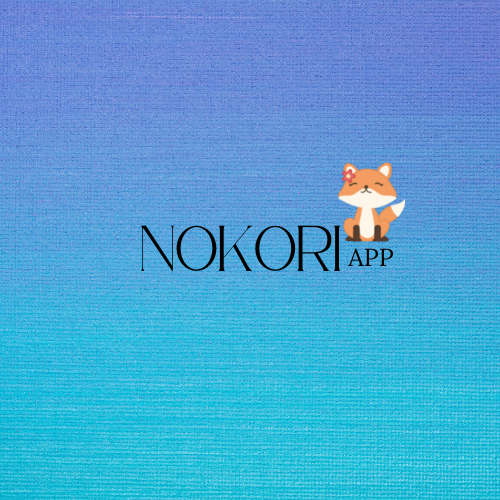

<!-- PROJECT LOGO -->
 

  

<h3 align="center">Nokori App</h3>

  

    A work-in-progress web application to allow users to search for animes and episode counts.
  

<!-- ABOUT THE PROJECT -->
## Built With

* Python
* Flask

(<a href="#top">back to top</a>)

<!-- USAGE EXAMPLES -->
## Future Updates

* Creating other language versions
* Refining the available search criteria

(<a href="#top">back to top</a>)

<!-- LICENSE -->
## License

Distributed under the MIT License. See `LICENSE.txt` for more information.

(<a href="#top">back to top</a>)
